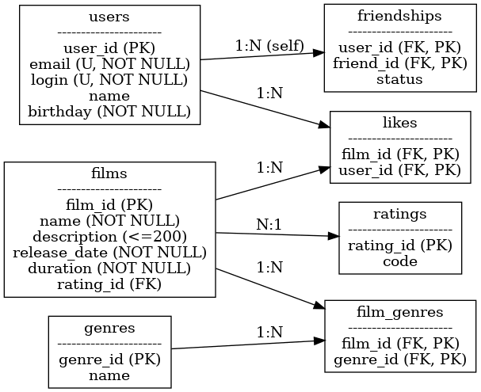

# java-filmorate
Template repository for Filmorate project.



Схема базы данных включает таблицы для пользователей (`users`), фильмов (`films`), жанров (`genres`), рейтингов (`ratings`), а также промежуточные таблицы для связей:
- `film_genres` — связь фильмов и жанров (многие-ко-многим),
- `likes` — лайки фильмов пользователями,
- `friendships` — дружба между пользователями.

## Примеры SQL-запросов

### Получить все фильмы
```sql
SELECT * FROM films;

SELECT f.film_id, f.name, COUNT(l.user_id) AS likes_count
FROM films f
LEFT JOIN likes l ON f.film_id = l.film_id
GROUP BY f.film_id
ORDER BY likes_count DESC
LIMIT N;


SELECT u.*
FROM friendships fr
JOIN users u ON fr.friend_id = u.user_id
WHERE fr.user_id = :id AND fr.status = 'CONFIRMED';


SELECT u.*
FROM friendships fr1
JOIN friendships fr2 ON fr1.friend_id = fr2.friend_id
JOIN users u ON fr1.friend_id = u.user_id
WHERE fr1.user_id = :id1
  AND fr2.user_id = :id2
  AND fr1.status = 'CONFIRMED'
  AND fr2.status = 'CONFIRMED';
