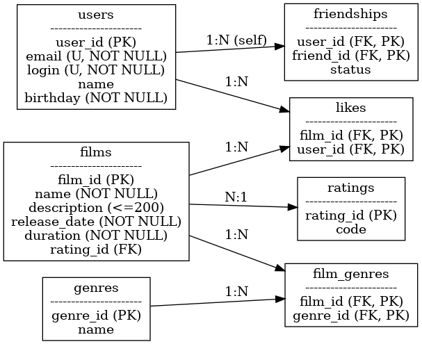

# 🎬 Filmorate — социальная сеть для оценки фильмов

[](https://www.oracle.com/java/)
[](https://spring.io/projects/spring-boot)
[](https://www.h2database.com/)
[](https://maven.apache.org/)

## 📋 О проекте

**Filmorate** — это backend-приложение для любителей кино, которое позволяет пользователям оценивать фильмы, находить друзей по интересам и получать персонализированные рекомендации. Проект разработан в рамках учебного курса по Java-разработке с акцентом на создание REST API, работу с базами данных и построение рекомендательных систем.

### Основные возможности
- ✅ Управление фильмами (CRUD операции)
- ✅ Управление пользователями (CRUD операции)
- ✅ Система лайков и рейтингов
- ✅ Управление друзьями (запросы, подтверждения)
- ✅ Каталог жанров (6 предопределенных жанров)
- ✅ Каталог рейтингов MPA (G, PG, PG-13, R, NC-17)
- ✅ Интеллектуальные рекомендации фильмов
- ✅ Топ популярных фильмов

## 🛠 Стек технологий

| Компонент | Технология | Назначение |
|-----------|------------|------------|
| Язык программирования | Java 21 | Основной язык разработки |
| Фреймворк | Spring Boot 3.2.4 | Создание веб-приложения |
| Работа с БД | Spring JDBC | DAO слой |
| База данных | H2 Database | Хранение данных |
| Сборка | Maven | Управление зависимостями |
| Тестирование | JUnit 5, MockMvc | Модульные и интеграционные тесты |
| Утилиты | Lombok | Генерация кода |
| Логирование | SLF4J, Logbook | Логирование запросов |


##📝 Схема базы данных



Схема базы данных включает таблицы для пользователей (`users`), фильмов (`films`), жанров (`genres`), рейтингов (`ratings`), а также промежуточные таблицы для связей:
- `film_genres` — связь фильмов и жанров (многие-ко-многим),
- `likes` — лайки фильмов пользователями,
- `friendships` — дружба между пользователями.

## Примеры SQL-запросов

### Получить все фильмы
```sql
SELECT * FROM films;

SELECT f.film_id, f.name, COUNT(l.user_id) AS likes_count
FROM films f
LEFT JOIN likes l ON f.film_id = l.film_id
GROUP BY f.film_id
ORDER BY likes_count DESC
LIMIT N;


SELECT u.*
FROM friendships fr
JOIN users u ON fr.friend_id = u.user_id
WHERE fr.user_id = :id AND fr.status = 'CONFIRMED';


SELECT u.*
FROM friendships fr1
JOIN friendships fr2 ON fr1.friend_id = fr2.friend_id
JOIN users u ON fr1.friend_id = u.user_id
